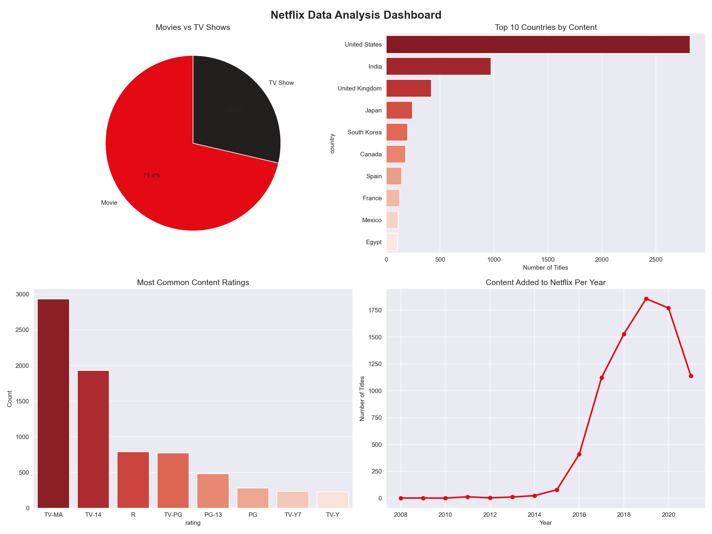

# Netflix Data Analysis Pipeline 

An end-to-end data analysis pipeline built with Python that extracts, cleans, analyzes, and visualizes the Netflix Movies & TV Shows dataset.

##  Dashboard Preview

##  What it does
- **Extracts** raw Netflix dataset (8000+ titles) from CSV
- **Transforms** data using Pandas — handles missing values, cleans columns, converts dates
- **Analyzes** key trends — content type, top countries, ratings, yearly growth
- **Visualizes** insights in a 4-chart dashboard using Matplotlib and Seaborn
- **Loads** cleaned data into a new CSV file

##  Key Insights
- Distribution of Movies vs TV Shows on Netflix
- Top 10 countries producing Netflix content
- Most common content ratings (TV-MA, TV-14 etc.)
- How Netflix content grew year by year

##  Technologies Used
- Python
- Pandas (data cleaning & transformation)
- Matplotlib (data visualization)
- Seaborn (advanced chart styling)
- Git & GitHub

##  How to Run

1. Clone the repository
   git clone https://github.com/ktejaswir15/netflix-data-pipeline.git

2. Install dependencies
   pip install pandas matplotlib seaborn

3. Add the dataset
   Download netflix_titles.csv from Kaggle and place it in the project folder

4. Run the pipeline
   python netflix_analysis.py

##  Output Files
- netflix_cleaned.csv — cleaned and transformed dataset
- netflix_dashboard.png — 4-chart analysis dashboard

##  Author
Tejaswi Kancherla
MS Computer Science — Wright State University
github.com/ktejaswir15
